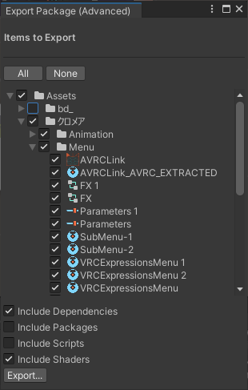

# Export Package (Advanced)

Advanced "Export Package" (without Scripts etc.)

## Install

### OpenUPM

See [OpenUPM page](https://openupm.com/packages/net.narazaka.unity.export-package-advanced/)

### VCC用インストーラーunitypackageによる方法（おすすめ）

https://github.com/Narazaka/ExportPackageAdvanced/releases/latest から `net.narazaka.unity.export-package-advanced-installer.zip` をダウンロードして解凍し、対象のプロジェクトにインポートする。

### VCCによる方法

1. https://vpm.narazaka.net/ から「Add to VCC」ボタンを押してリポジトリをVCCにインストールします。
2. VCCでSettings→Packages→Installed Repositoriesの一覧中で「Narazaka VPM Listing」にチェックが付いていることを確認します。
3. アバタープロジェクトの「Manage Project」から「Export Package (Advanced)」をインストールします。

## Usage

Unity 標準の Export Package と同じように、アセットの右クリックメニューから「Export Package (Advanced)」を選んで使用します。

## License

[Zlib License](LICENSE.txt)
